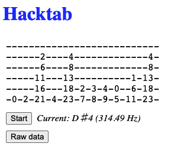

# Tabbyhack -- alpha release

**Demo is running at https://jzohrab.github.io/tabbyhack/**

A work-in-progress tool to generate guitar TAB from audio input.  This could be useful for teachers and guitar hackers to get quick TAB snippets.

Visit its site and click start, allow mic access, and start playing -- slowly, and only a single note at a time (no chords).  It will generate some candidate TAB, it's up to you to edit the TAB to select the notes you really want.

Sample output, generated by going to https://jzohrab.github.io/tabbyhack/, clicking 'Start', and playing some notes on the guitar:



Explanation: The first two notes are ok, but then I played 2nd fret on the B string ... the app found several candidate tabbing positions for that, resulting in the third stack of notes.  etc for the remaining notes.  Not great, but not bad for pre-alpha software.  If I or others can sort out how to edit this generated tab easily (see "Future work" below), it could be interesting.

Devs can also run the site locally, see "Development" below.

## Future work (?)

This is a basic tool -- it's not a fully functional tab solution -- but it's still pretty useful.  It will never be a full tabber, that's not the intent.  Possible improvements:

* edit the tab, removing bad notes etc
* low priority: output raw data in some other form so it can be imported into other software (?)
* low priority for me, but maybe fun: styling & make it pretty
* allow for different guitar tunings, tab for out-of-tune guitars, etc
* this could be easily generalized to all fretted instruments (provided the mic can differentiate the sound)

# Development

## Overview

This project uses:

- Parcel for bundling the Javascript
- Tape for unit tests
- Aubiojs for js audio processing

## Requirements

node - v14.16.0
npm - 6.14.11

I haven't tried other versions, but the above worked for me on my Mac.

## Getting started

```
git clone <this repo>
cd <repo path>
npm install

# Build and start the local Parcel server
npm start

# Then go to the local address it tells you
```

## Running tests

`npm run test`

## Contributing

Contributions would be super if it makes this more useful and interesting.

Fork; clone; make you changes and be sure to run `npm run test`; PR back to main.

# Deployment

## To github pages

After running tests, and checking the local site with `npm start`, we can deploy this automatically to a github pages repo by having everything deployed to `docs`.  See ref https://www.sitepoint.com/parcel-hyperapp-github-pages/

`npm run deploy` builds, commits, and pushes.  GH pages take a few moments to update.

# Licensing

TODO - should be free and open.  Have to set the licensing correctly to account for the open-source elements that are included (aubio)
